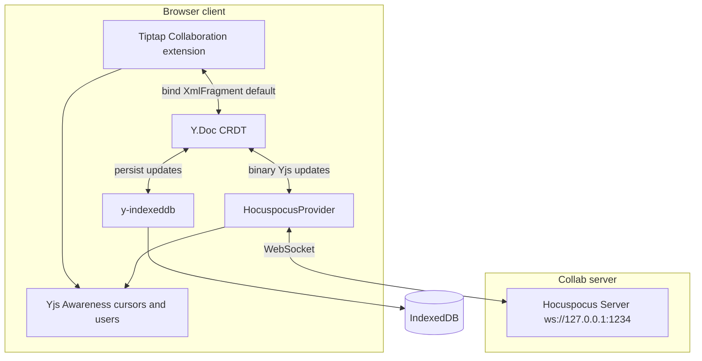

# live-doc

A collaborative rich-text editor built with [Tiptap](https://tiptap.dev/) and [Yjs](https://docs.yjs.dev/). Multiple clients edit the same document in real time, with local persistence and offline-friendly sync.

## Getting started

Install dependencies, then run the Next.js app and the collaboration server together:

```bash
npm install
npm run dev:all
```

Open [http://localhost:3000](http://localhost:3000). Open a second tab or browser to see live cursors and edits.

| Script            | What it runs                                                            |
| ----------------- | ----------------------------------------------------------------------- |
| `npm run dev:all` | Next.js (`next dev`) + Hocuspocus collab server (`tsx server/index.ts`) |
| `npm run dev`     | Next.js only (editing works offline via IndexedDB; no peer sync)        |
| `npm run collab`  | Hocuspocus server only (default `ws://127.0.0.1:1234`)                  |

**Environment variables**

- `NEXT_PUBLIC_HOCUSPOCUS_URL` — WebSocket URL for the client provider (default `ws://127.0.0.1:1234`)
- `HOCUSPOCUS_PORT` — Port for the collab server (default `1234`)

## Architecture

Document state flows through four layers: the editor, the CRDT, local storage, and the network.



1. **Edit** — Keystrokes go through Tiptap → ProseMirror transaction → the Collaboration extension writes into the shared `Y.XmlFragment` (`default` field).
2. **Merge** — Yjs applies CRDT updates locally. The editor stays editable when the socket is down; connectivity is a sync concern, not an edit lock ([`src/components/Editor.tsx`](src/components/Editor.tsx)).
3. **Persist** — [y-indexeddb](https://github.com/yjs/y-indexeddb) writes document updates to IndexedDB asynchronously so content survives refresh and brief offline periods.
4. **Sync** — [HocuspocusProvider](https://tiptap.dev/hocuspocus) exchanges compact binary Yjs updates with peers over WebSocket; the Hocuspocus server fans out updates to everyone in the room.

Awareness (active users, remote carets) uses the same WebSocket channel but is **ephemeral**—it is not stored in IndexedDB.

Key files:

- [`src/hooks/useCollaboration.ts`](src/hooks/useCollaboration.ts) — wires `Y.Doc`, IndexedDB persistence, and Hocuspocus
- [`src/components/Editor.tsx`](src/components/Editor.tsx) — Tiptap + Collaboration extensions
- [`server/index.ts`](server/index.ts) — Hocuspocus server

## Performance

High-frequency paths (caret movement, presence) are throttled or deduped. Document edits rely on Yjs’s efficient update model and async IndexedDB I/O rather than blocking the UI thread on network ACKs.

| Technique                            | Where                                                                                                  | Effect                                                                                                                                                                                |
| ------------------------------------ | ------------------------------------------------------------------------------------------------------ | ------------------------------------------------------------------------------------------------------------------------------------------------------------------------------------- |
| **rAF-throttled cursor awareness**   | [`src/lib/throttleAwarenessCursorBroadcast.ts`](src/lib/throttleAwarenessCursorBroadcast.ts)           | Coalesces rapid selection/caret updates to at most one outbound awareness message per animation frame. `null` clears stay synchronous so blur/teardown removes the caret immediately. |
| **Stable React snapshots for peers** | [`src/hooks/useCollaborationAwarenessPeers.ts`](src/hooks/useCollaborationAwarenessPeers.ts)           | `useSyncExternalStore` plus a WeakMap cache returns the same `peers` array reference until membership changes—fewer header re-renders on unrelated awareness churn.                   |
| **Debounced connection UI**          | [`src/hooks/useCollaboration.ts`](src/hooks/useCollaboration.ts) (`DISCONNECT_DISPLAY_DELAY_MS = 300`) | Absorbs brief WebSocket churn and React Strict Mode remounts without flashing “offline” and triggering layout thrash.                                                                 |
| **Gate editor on IDB sync**          | `persistence.on('synced')` before `setReady(true)`                                                     | Avoids mount-time fights between an empty Y fragment and content restored from IndexedDB.                                                                                             |
| **`immediatelyRender: false`**       | [`src/components/Editor.tsx`](src/components/Editor.tsx)                                               | Standard Tiptap pattern to avoid extra SSR/hydration render work on the client.                                                                                                       |
| **Yjs binary deltas**                | Yjs + Hocuspocus                                                                                       | Document sync sends merged CRDT updates, not full HTML round-trips—less parse/serialize pressure than ad-hoc JSON over sockets.                                                       |

## Why Yjs (CRDT) instead of Socket.io?

[Socket.io](https://socket.io/) is a real-time **transport**: rooms, events, reconnection. It does not define _how_ to merge concurrent edits to a shared document. For collaborative rich text you still need a merge model—CRDT (Yjs), operational transform, or hand-rolled conflict resolution (last-write-wins, locking). Those approaches are easy to get wrong with structured content.

**Yjs + Tiptap are designed together.** [@tiptap/extension-collaboration](https://tiptap.dev/docs/editor/extensions/functionality/collaboration) binds ProseMirror state to a `Y.XmlFragment`. The surrounding ecosystem—[y-indexeddb](https://github.com/yjs/y-indexeddb), [y-protocols](https://github.com/yjs/y-protocols) awareness, [Hocuspocus](https://tiptap.dev/hocuspocus)—speaks Yjs binary updates end to end.

**Offline-first by default.** A local `Y.Doc` plus IndexedDB keeps edits flowing when the socket drops. On reconnect, Hocuspocus replays missed updates into the same CRDT. Socket.io alone would still require separate persistence, snapshotting, and merge logic.

**WebSockets without reinventing sync.** This project uses WebSockets through Hocuspocus, not Socket.io, because Hocuspocus implements the Yjs sync protocol out of the box. You get document sync and awareness without building a custom event schema on top of a generic pub/sub layer.

Further reading: [Yjs documentation](https://docs.yjs.dev/), [Hocuspocus](https://tiptap.dev/hocuspocus).
