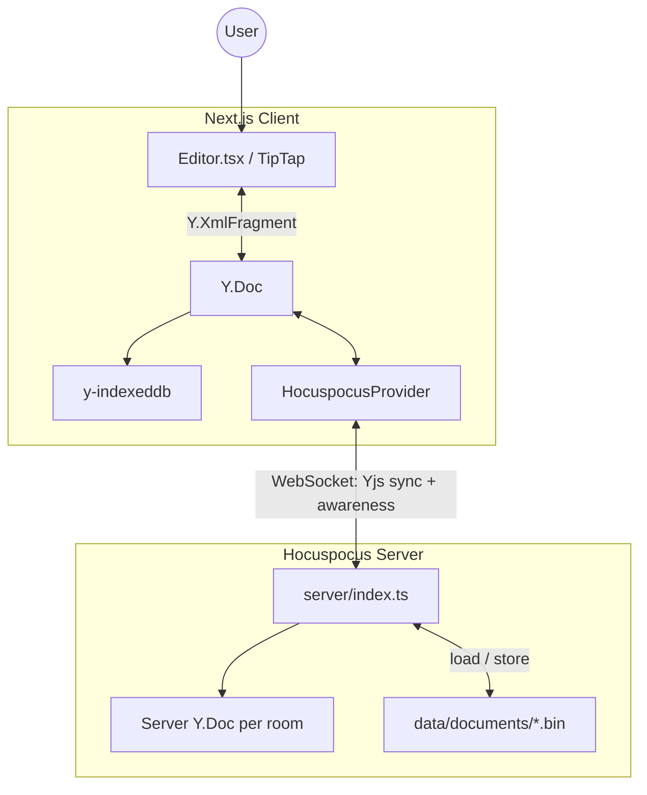

# Collaborative Document Editor

[](https://github.com/ploymahloy/live-doc/actions/workflows/ci-cd.yml)

## Inspiration

Built to practice working with WebSockets in a real-time collaborative editing context — multiple users editing the same document simultaneously, with cursors and presence synced over a live connection.

## Tech Stack

- **Next.js 16 + TypeScript + React** — frontend and routing via App Router (`/`, `/doc/[id]`)
- **WebSockets** — real-time sync via [Hocuspocus](https://tiptap.dev/hocuspocus) (`@hocuspocus/server` + `@hocuspocus/provider`)
- **Yjs** — CRDT document model; shared `Y.XmlFragment` field
- **TipTap** — rich-text editor with `@tiptap/extension-collaboration` and collaboration caret (cursors)
- **y-indexeddb** — client-side offline cache
- **Vitest + fast-check** — collaboration correctness tests

Deployed on Vercel (client) and Railway (WebSocket server).

## How It Works



The document ID is a UUID in the URL. That same UUID is the WebSocket room name, the IndexedDB key, and the persistence filename on disk.

Edits flow from TipTap into a Yjs update, which is relayed over WebSocket (the server merges and broadcasts to peers) and cached locally in IndexedDB. Awareness data — cursors and collaborator avatars — travels over the same WebSocket connection, separate from document content. There is no REST API; sharing is URL-based (`/doc/{uuid}`).

Key source files: [`src/hooks/useCollaboration.ts`](src/hooks/useCollaboration.ts), [`server/index.ts`](server/index.ts), [`src/lib/collaborationEditor.ts`](src/lib/collaborationEditor.ts).

## Testing Strategy

Collaboration correctness is verified with Vitest (`happy-dom` environment, 120s timeout) and property-based tests via fast-check. Tests run in-memory with a simulated hub-and-spoke sync network — no live WebSocket server required.

```bash
npm test
npm run test:watch
```

| Category           | File                                 | Behavior                                                    |
| ------------------ | ------------------------------------ | ----------------------------------------------------------- |
| CRDT commutativity | `crdtCommutativity.property.test.ts` | Concurrent updates converge regardless of apply order       |
| CRDT idempotence   | `crdtIdempotence.property.test.ts`   | Re-applying updates is a no-op                              |
| Network chaos      | `networkChaos.property.test.ts`      | Delayed/shuffled delivery and partition/heal still converge |
| Conflict intent    | `conflictIntent.test.ts`             | Paragraph delete vs lagging insert converges                |

Tests use the real TipTap + Yjs stack with a simulated network ([`network/yjsSyncNetwork.ts`](src/test/collaboration/network/yjsSyncNetwork.ts)) that mirrors Hocuspocus behavior. fast-check generates random editor operations (inserts, deletes, formatting) across multiple replicas.

All test sources live under [`src/test/collaboration/`](src/test/collaboration/). Not covered: browser E2E, live WebSocket server, React component tests, persistence.

## Demo (before I run out of free credits):


